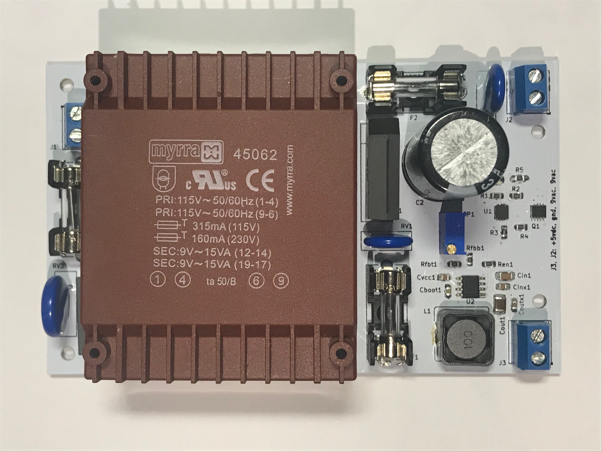
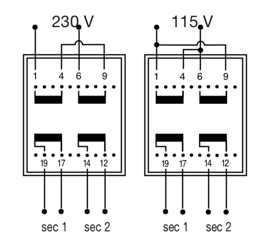
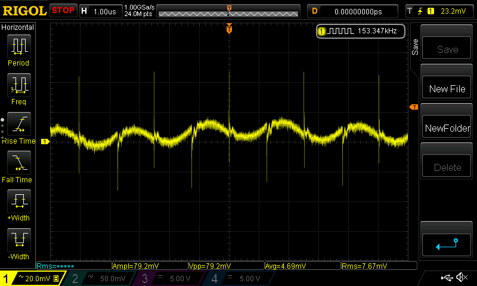
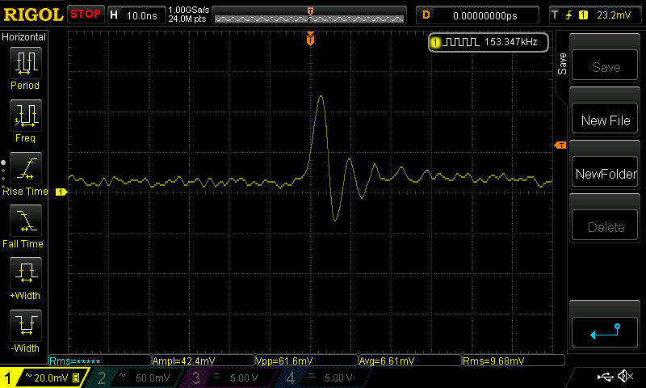
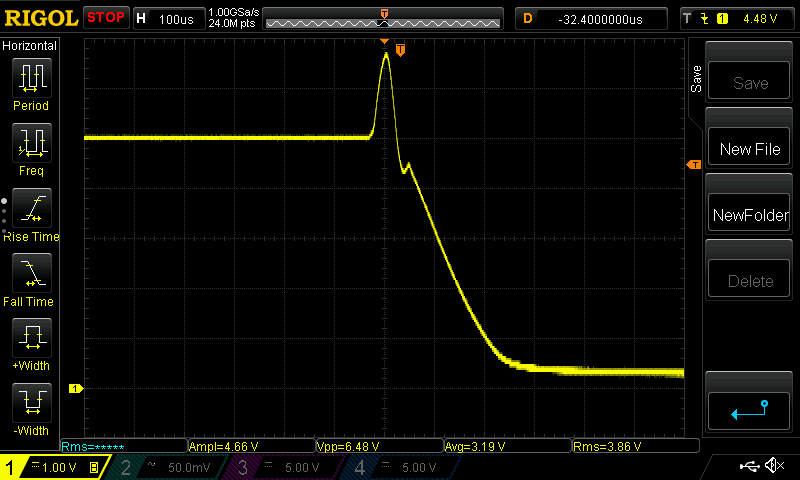
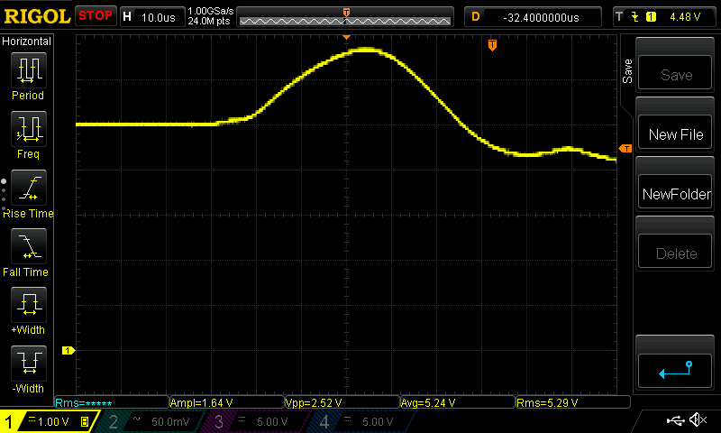
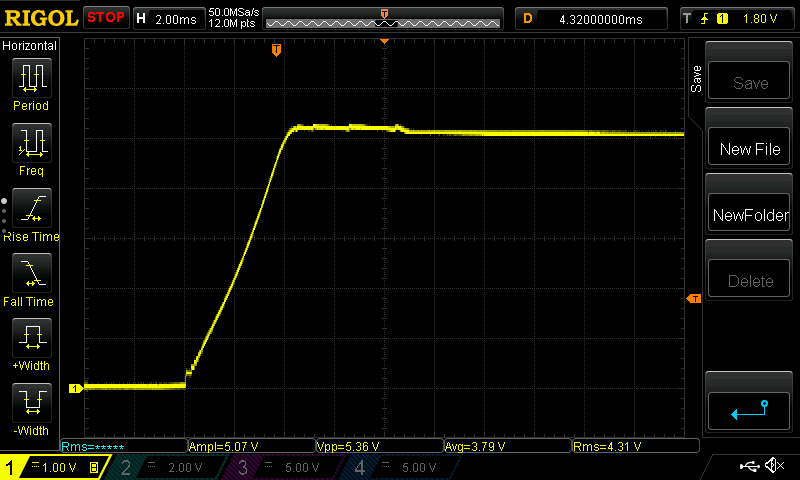

# C64 power supply unit

**Warning: WORK IN PROGRESS. BUILD AT YOUR OWN RISK**

This is a compact and efficient 9VAC/5VDC power supply for the Commodore 64 with the following features:

* 220VAC input (sorry 110VAC countries, but read below).
* 5 VDC output, adjustable, 2A max.
* 9 VAC output, 1.67A max.
* 6.5 VDC overvoltage protection (latching).
* Low VDC output ripple (<20 mVpp @2A).
* 2A overcurrent protection.
* Low heat dissipation.
* Mains overvoltage and noise suppresion.

## Adjusting 5VDC output

Start adjusting trimpot TP1 to get 5 VDC with no load.

Then check the voltage at the C64 input with the computer on. You should expect a bit less than 5V due to losses depending on the cable gauge and DIN connectors. Ideally you should aim at 5.0V but a bit of undervoltage (4.9V) appears to work okay on most C64 and will lower heat dissipation.

Output voltage can be adjusted in the [4.13V, 5.55V] range.

## Design details

This PSU uses a 9VAC, 30VA dual secondary (15 VA + 15 VA) transformer that provides up to 1.67 amps on each secondary.

The regulator is a TI LMR33630 switching DC/DC step down converter, switching frequency ~400 KHz and a peak efficiency of 93%.

The maximum rating of the most important MOS chips (6510, 6581, 6567 and 6526) is 7.0V, so it's important to not exceed this voltage under any circumstance.

The voltage supervisor is a Maxim MAX6399 that cuts down the regulator's input if the output goes over 6.5V. The MAX6399 also provides undervoltage protection for clean startup of the switcher.

## 110VAC operation

To work at 110 VAC, do these modifications to the schematic:

1. Connect the two primaries of TR1 in parallel instead of series:

2. Replace RV3 (EPCOS 300 Vrms MOV) with EPCOS B72214S0151K101 (150 Vrms MOV).
3. Replace F3 (160 mA fuse) with 315 mA fuse.

## Tests

### Output ripple

Test conditions: Vout=5.1V, Iout=1A.

* High frequency ripple: 79mVpp
* Low frequency ripple: <20mVpp

### High frequency ringing

Test conditions: Vout=5.1V, Iout=1A.

### Overvoltage protection

Overvoltage protection voltage threshold set at Vout >= 6.53V via R1/R2 divider.

Test conditions: shorted feedback input of LMR33630 to GND during normal operation at Vout=5.1V, Iout=1A.

@ 100 us per division:

@ 10 us per division:

### Startup overshoot

Nominal Vout: 5.10V
Overshoot: 5.36V (<10 ms)

### Power-ok and Vout ramp-up

Undervoltage protection voltage threshold set at Vin <= 6.81V via R3/R4 divider.

* Yellow: Vout
* Cyan: MAX6399 Power OK output (LMR33630 ENABLE input)

## TODO

* Improve HF output noise
* Case + strain relief models for 3D printing
* Actually test that this doesn't blow anything up. Tests should include at least:
  * Thermal behavior
  * Undervoltage POK (both edges)
  * Secondary-primary noise coupling
  * EMI emissions
