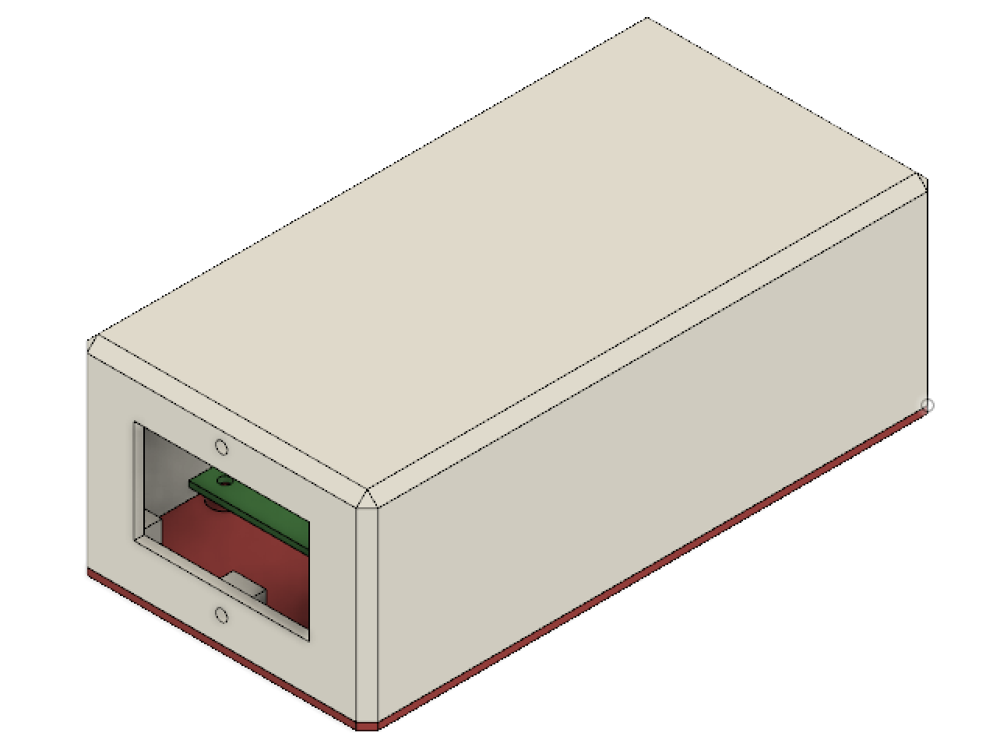
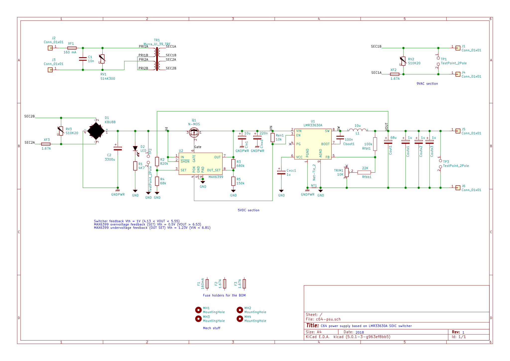

# C64 power supply unit

This is a compact and efficient 9VAC/5VDC power supply for the Commodore 64 with the following features:

* 230VAC input (but easy to modify for 115VAC operation).
* 5 VDC output, adjustable, 1.75A max.
* 9 VAC output, 1.67A max.
* 6.5 VDC overvoltage protection (latching).
* Low VDC output ripple (<25 mVpp @1A).
* 2A overcurrent protection.
* Low heat dissipation.
* Mains overvoltage and noise suppresion.

## Building, warnings and recommendations

The kicad-project/gerbers folder contains gerber files ready for production. These are my recommended PCB specifications:

* 1.6 mm PCB thickness
* 2 oz copper thickness
* Min track / clearance: 8 mil

Beware there are three SMD components with thermal pads on the base that can't be easily soldered with a regular iron. You'll need **solder paste and an oven or a heat gun for these**.

## 110VAC operation

To work at 110 VAC, do these modifications to the schematic:

1. Connect the two primaries of TR1 in parallel instead of series:

2. Replace RV3 (EPCOS 300 Vrms MOV) with EPCOS B72214S0151K101 (150 Vrms MOV).
3. Replace F3 (160 mA fuse) with 315 mA fuse.

## Adjusting 5VDC output

Start adjusting trimpot TP1 to get 5 VDC with no load.

Then check the voltage at the C64 input with the computer on. You should expect a bit less than 5V due to losses depending on the cable gauge and DIN connectors. Ideally you should aim at 5.0V but a bit of undervoltage (4.9V) appears to work okay on my C64 and will lower heat dissipation.

Output voltage can be adjusted in the [4.13V, 5.55V] range.

## Enclosure

STLs and Fusion 360 project included in the enclosure/ folder. Sorry FreeCAD, I tried to keep this opensource but bodies in 0.17 are just not mature enough and doing this in 0.16 was too painful.

### Printing recommendations

* The bottom side can be printed bottom side flat on the printer bed without support.
* The top cover can be printed top side flat on the bed with supports everywhere.
* Material: I recommend PETG because of its higher melting temperature, great mechanical properties and low warping.
* I do not recommend PLA because of its low melting temperature.
* I do not recomment ABS either because of its high contraction ratio (= corner warp).

For the enclosure, in addition to the BOM components, you'll need:

* 6 x [Female quick disconnect 4.8 mm terminals](https://www.aliexpress.com/item/Free-shipping-100pcs-lot-4-8-insert-the-plug-spring-sheathed-wire-terminal-connector-cold-pressed/32593657279.html)
* 6 x [PCB male quick disconnect (aka spade) 4.8mm terminals](https://www.aliexpress.com/item/100pcs-4-8-Inserts-Plug-Spring-Terminal-PCB-Solder-lug-type-thickness-0-8mm-two-legs/32707189841.html) (these can replace the ones on the BOM and are much cheaper)
* 1 x [M12 PG7 strain relief](https://www.aliexpress.com/item/10pcs-Waterproof-M16-PG9-M12-PG7-Cable-Connectors-Spiral-Strain-Relief-Protector/32923675313.html)
* 1 x [Panel mount AC socket + rocking switch + fuse](https://www.aliexpress.com/item/Power-Rocker-Switch-IEC-3-Pin-320-C14-Inlet-Power-Sockets-Switch-Connector-Plug-10A-250V/32802047471.html)
* 1 x [4 cores, 5 meters 20 AWG cable](https://www.aliexpress.com/item/20-AWG-0-5MM2-RVV-2-3-4-5-6-7-8-10-12-14-16/32921926304.html)
* 1 x [7 pin male DIN connector (5 pcs minimum order)](https://www.aliexpress.com/item/5pcs-DIN-male-Plug-Connector-7-Pin-with-Plastic-Handle/32386538198.html)
* 10 x [M3x8 hex head bolts (100 units minimum order)](https://www.aliexpress.com/store/product/Free-Shipping-100pcs-Lot-Metric-Thread-DIN912-M3x8-mm-M3-8-mm-304-Stainless-Steel-Hex/3094064_32851042824.html)
* 10 x [M3 nuts (100 units min order)](https://www.aliexpress.com/item/Free-shipping-100pcs-lot-Metric-thread-DIN934-M3-304-Stainless-Steel-Hex-Nuts/32405600179.html)

### Cable length

I recommend keeping the C64-side cable as short and thick as possible. I recommend 20 AWG, 1 meter long wires.

The expected loss over 1 meter of 20 AWG wire at 5VDC and 1A is 33 mV per leg or 67 mV round trip.

## Schematic and protective measures

This PSU uses a 9VAC, 30VA dual secondary (15 VA + 15 VA) transformer that provides up to 1.67 amps on each secondary.

The regulator is a TI LMR33630 switching DC/DC step down converter with a switching frequency ~400 KHz and a peak efficiency of 93%.

To prevent an overvoltage situation due to failure of the swithing regulator or the feedback network, a MAX6399 voltage supervisor is used to control a high side P-channel MOSFET at the input of the switcher. When an overvoltage condition (Vout >6.5V) is detected, the MAX6399 pulls the gate of the MOSFET down and cuts the regulator input until the power is completely removed from the unit.

The MAX6399 also provides undervoltage protection for clean startup of the switcher.

In addition to the over/undervoltage supervisor 3 varistors (MOVs) provide surge protection on the primary and both secondaries and 3 fuses prevent prolonged overcurrent condition on both sides of the transformer. The switcher itself also has an instant overcurrent protection above 3A.

## Tests

### Output ripple

Test conditions: Vout=5.1V, Iout=1A.

* Low frequency ripple: <20mVpp

### Overvoltage protection

Overvoltage protection voltage threshold set at Vout >= 6.53V via R1/R2 divider.

Test conditions: shorted feedback input of LMR33630 to GND during normal operation at Vout=5.1V, Iout=1A.

@ 100 us per division:

@ 10 us per division:

### Startup overshoot

Nominal Vout: 5.10V
Overshoot: 5.36V (<10 ms)

### Power-ok and Vout ramp-up

Undervoltage protection voltage threshold set at Vin <= 6.81V via R3/R4 divider.

* Yellow: Vout
* Cyan: MAX6399 Power OK output (LMR33630 ENABLE input)

## TODO

* Actually test that this doesn't blow anything up. Tests should include at least:
  * Thermal behavior
  * Undervoltage POK (both edges)
  * Secondary-primary noise coupling
  * EMI emissions

## License

CC-BY-NC-SA (Attribution-NonCommercial-ShareAlike).

See LICENSE.txt for details.

Please do not mass (?) produce this without my permission.

